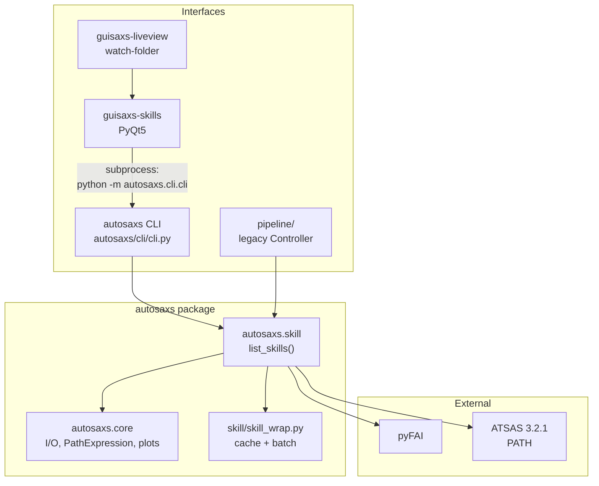

# AGENTS.md — navigation cache for this repo

**Purpose:** structural and architectural notes so agents do not re-discover the codebase each session.  
**Not** a user manual — see `README.md`, `autosaxs-docs/skills_reference.md`, `docs/`, and `autosaxs get-docs`.  
**Maintain this file:** update when you add/move modules, change architecture, or learn a non-obvious convention.

---

## Workspace layout

| Path | What it is |
|------|------------|
| `/home/mikl/KurchatovCoop/autosaxs/` | **Package git repo** — `pyproject.toml`, `src/`, tests, docs, `.cursor/` (→ GitHub `autoSAXS`) |
| `/home/mikl/KurchatovCoop/autosaxs/src/` | **Installable packages** (`autosaxs`, `guisaxs_skills`, `guisaxs_liveview`) |
| `/home/mikl/KurchatovCoop/saxsprocessing/` | **Lab / experiments** (notebooks, one-off scripts); not a git repo; assumes `autosaxs` is installed |
| `/home/mikl/KurchatovCoop/` | **Parent workspace** — validation data, sample TIFFs, experiment outputs |
| `/home/mikl/KurchatovCoop/.cursor` | Symlink → `autosaxs/.cursor` |

Real-data tests expect validation fixtures under **`/home/mikl/KurchatovCoop/validation/`** (setup: `scripts/setup_validation_data.py`).

---

## Packages at a glance

Single distribution (`pyproject.toml`, version in `[project].version`). Three console entry points:

| Entry point | Package | Status | Role |
|-------------|---------|--------|------|
| `autosaxs` | `src/autosaxs/` | **active** | Core SAXS processing + CLI |
| `guisaxs-skills` | `src/guisaxs_skills/` | **active** | PyQt5 skill console |
| `guisaxs-liveview` | `src/guisaxs_liveview/` | **active** | Thin launcher → `guisaxs_skills.liveview` |

GUI extras: `pip install -e .[gui]` (adds `PyQt5`, `watchdog`).

---

## Architecture (high level)


```mermaid
flowchart TB
  subgraph interfaces [Interfaces]
    CLI["autosaxs CLI\nautosaxs/cli/cli.py"]
    SkillsGUI["guisaxs-skills\nPyQt5"]
    Liveview["guisaxs-liveview\nwatch-folder"]
    LegacyPipe["pipeline/\nlegacy Controller"]
  end

  subgraph core_pkg [autosaxs package]
    Skill["autosaxs.skill\nlist_skills()"]
    Core["autosaxs.core\nI/O, PathExpression, plots"]
    Wrap["skill/skill_wrap.py\ncache + batch"]
  end

  subgraph external [External]
    PyFAI["pyFAI"]
    ATSAS["ATSAS 3.2.1\nPATH"]
  end

  CLI --> Skill
  SkillsGUI -->|"subprocess:\npython -m autosaxs.cli.cli"| CLI
  Liveview --> SkillsGUI
  LegacyPipe --> Skill
  Skill --> Core
  Skill --> Wrap
  Skill --> PyFAI
  Skill --> ATSAS
```

**Paradigm:** processing = **skills** (pure functions returning output path dicts). Pipelines are composed outside the package (scripts, liveview `plan_for` + executor, legacy `Controller`). Spec: `docs/skills_paradigm.md`.

**GUI rule:** PyQt apps **do not** call skill functions in-process for execution. They introspect `autosaxs.skill` for metadata, then run `python -m autosaxs.cli.cli <skill> ...` via `guisaxs_skills/logic/runner_qprocess.py` (`SkillRunner`).

**Exception:** the liveview monodisperse **P(r) / GNOM adjust** wizard and polydisperse **D(R) / GNOM adjust** wizard may call `autosaxs.core.atsas_gnom` in-process for interactive plot/passport preview. Disk persistence still goes through `SkillRunner` → `fit_distances` / `fit_sizes`. Parameterized refine (`dmax_nm` / `rmax_nm`) rewrites stable best outs (`datgnom_best.out` / `gnom_best.out`) plus the close-fits ensemble and force-zero-off probe unless `minimal=True`.

---

## `autosaxs/` — where is what

```
autosaxs/
├── skill/          # PUBLIC API — one callable per processing step
├── core/           # Low-level algorithms, I/O, PathExpression (no skill imports)
├── cli/            # argparse CLI; subcommands generated from skill signatures
├── pipeline/       # Legacy interactive multi-step workflow (EventBus + Controller)
├── foreign/        # Vendored supervised_ml, aiAssistantFramework
└── resources/      # Bundled config, prompts, help HTML, AI skill templates
```

### `autosaxs/skill/` — skills registry

- **Discovery:** `autosaxs.skill.list_skills()` — single source of truth for CLI and GUI.
- **Order:** `SKILL_ORDER` in `skill/__init__.py`.
- **Layout:** mostly one module per skill; subpackages for heavy skills (`calibrate/`, `fit_guinier/`, `model_mixture/`).
- **Infrastructure (not skills):** `skill_wrap.py` (cache + `@apply_batch`), `common.py` (path coercion), `config.py` (merge bundled + user config), `deps.py` (internal import hub).

| Skill | Module | Notes |
|-------|--------|-------|
| calibrate | `skill/calibrate/` | Ring analysis + geometry; writes `effective_mask.npy` + `auto_mask.npy` alongside `integrator/` |
| integrate | `skill/integrate.py` | 2D→1D via saved integrator; default mask = sibling `effective_mask.npy`, or `--mask` replace |
| average | `skill/average.py` | CorMap frame selection |
| integrate_proxy | `skill/integrate_proxy.py` | Quick-look without calibration |
| subtract | `skill/subtract.py` | Buffer subtraction |
| plot | `skill/plot.py` | Guinier / Kratky / log-log |
| plot_2d | `skill/plot_2d.py` | 2D detector PNGs |
| fit_guinier | `skill/fit_guinier/` | Adaptive Guinier region |
| analyze_kratky | `skill/analyze_kratky.py` | Dimensionless Kratky conformation analysis |
| fit_distances | `skill/fit_distances/` | DATGNOM monodisperse p(r); GNOM refine+ensemble when `dmax_nm` set (`minimal` skips ensemble) |
| fit_sizes | `skill/fit_sizes/` | GNOM polydisperse D(R); refine+ensemble when `rmax_nm` set (`minimal` skips ensemble) |
| model_mixture | `skill/model_mixture/` | ATSAS MIXTURE (`fit_mixture` deprecated alias) |
| model_bodies | `skill/model_bodies.py` | ATSAS BODIES (`fit_bodies` deprecated alias) |
| model_dam | `skill/model_dam.py` | DAMMIF ab initio (+ DAMAVER when n_runs>1) |
| model_density | `skill/model_density/` | DENSS continuous density |
| report_individual | `skill/report_individual.py` | Per-sample PDF from fragments |
| report_summary | `skill/report_summary.py` | Pipeline summary PDF |

**Adding a skill:** register in `_SKILL_IMPORTS` (`skill/__init__.py`), add to `SKILL_ORDER`, extend `tests/must-run/real_data/` when the skill belongs on the real-data path, otherwise add a focused case in `tests/must-run/skills/test_contracts.py` (edges / skills not yet on that path).

### `autosaxs/core/` — primitives

| Module | Look here for… |
|--------|----------------|
| `path_expression.py` | Typed path/glob/comma-list expansion (`Dat`, `Tiff`, `Mask`, …) |
| `utils.py` | `read_saxs`, `write_saxs`, `load_config`, detector helpers, `LATEST_STEPS_PATH` |
| `integrator.py` | `IntegratorExtended` (pyFAI wrapper; geometry in `integrator/`, masks alongside as `effective_mask.npy` / `auto_mask.npy`) |
| `detector_shape.py` | Frame/mask `(H,W)` helpers; `require_mask_matches_frame` (skills + liveview gates) |
| `guinier.py` | Pure Guinier math |
| `gnom.py` | GNOM `.out` parsing, candidate scoring |
| `pddf.py` | p(r) from BODIES/DAMMIF shapes |
| `viewer.py` | Matplotlib plotting (`PLTViewer`) |
| `report_fragments.py` | Decentralized `*_report_individual.md` / `*_report_summary.yaml` |
| `event_bus.py` | `EventBus`, `EventType` (pipeline + optional skill progress) |
| `context.py` | `Context` — working dir, config |

### `autosaxs/cli/`

- Entry: `autosaxs.cli:main` → `cli/cli.py`.
- Subcommands: auto-built from `list_skills()` signatures (`--kebab-case` options, `--cache`/`--no-cache`, `--conf`).
- Agent helpers: `get-docs`, `get-skills`, `get-default-config` (see `resources/agent_quickstart.txt`).
- **Invoke as:** `python -m autosaxs.cli.cli` (no `__main__` on `autosaxs.cli`).

### `autosaxs/pipeline/` — legacy interactive orchestration

| Module | Role |
|--------|------|
| `saxs_controller.py` | `Controller` — event-driven step sequencer |
| `cli_interface.py` | Stdin prompts ↔ EventBus |
| `gui_interface.py` | CustomTkinter dialogs ↔ EventBus |
| `api.py` | `fast_first_processing` script API |

**Legacy.** Prefer skills + scripts or liveview `plan_for`. Lab entry may still call `Controller` from `saxsprocessing/pipeline.py`. No separate interactive-pipeline product spec — see `docs/skills_paradigm.md` for the skills contract.

### `autosaxs/resources/`

| Path | Contents |
|------|----------|
| `config_base.conf` | Bundled skill-keyed YAML defaults (`calibrate:`, `subtract:`, …) |
| `agent_quickstart.txt` | CLI epilog for agents |
| `help/guisaxs_liveview/` | Bundled HTML help (manifest + pages) |
| `ai_skills/`, `prompts/` | LLM / assistant templates |
| `readme/` | Source for generated README |

---

## GUI packages

### `guisaxs_skills/` — main GUI codebase

```
guisaxs_skills/
├── app.py, __main__.py     # guisaxs-skills entry
├── core/                   # SkillMeta, RunRequest, paths, settings, event_bus
├── logic/                  # skill_catalog, runner_qprocess, smart_defaults, …
├── ui/                     # main_window, skill_form, style, path_field, previews
└── liveview/               # watch-folder app (also used by guisaxs-liveview)
    ├── app.py, window.py   # entry + main window shell
    ├── controller/         # LiveviewController + handlers (history, ingest, session, …)
    ├── pipeline/           # plan_for, LiveviewJobExecutor, jobs, queue
    ├── ingest/             # settle, watchers, stability, sample_revision, curve_classify
    ├── modeling_children.py # shape/DR child QProcess + ModelingContext for current sample
    ├── session/            # state, sample, sample_store, persistence, output_paths, workdir
    ├── services/           # artifacts, calibration, history (sync_middle_view), skills
    └── ui/
        ├── panels/         # left, middle, right/
        ├── wizards/        # calibration, buffer, mask, fit, subtraction, GNOM adjust
        └── widgets/        # plots, viewer_3d
```

Sibling package for modeling apps: `guisaxs_skills/modeling/` (also launched as `guisaxs-shape` / `guisaxs-dr`).

**Key modules:**

| Module | Role |
|--------|------|
| `logic/skill_catalog.py` | `discover_skills()` from `autosaxs.skill` → `SkillMeta` |
| `ui/skill_form.py` | Dynamic form from `SkillMeta`; emits `RunRequest` |
| `ui/style.py` | **Canonical** PyQt theme/colors (`COLOR_MUTED_TEXT`, `apply_style`) |
| `ui/path_field.py` | Path input with DnD |
| `logic/runner_qprocess.py` | `SkillRunner` — subprocess CLI, streams logs |
| `logic/app_relaunch.py` | Detached liveview process relaunch (watchdir change, post-update) |
| `logic/autosaxs_cli.py` | Blocking `get-default-config` helper |
| `liveview/pipeline/plan.py` | `plan_for(session, sample, completed=?)` — sole pipeline decision owner |
| `liveview/pipeline/executor.py` | Queue worker facade; `manual_jobs` / `artifact_enrichment`; progress via `Job` API |
| `liveview/session/api.py` | `LiveviewSession` — facts + safe mutations (intake, Auto/Manual, buffer, arming) |
| `liveview/session/state.py` | Session fact bag |
| `liveview/session/sample.py` / `sample_store.py` | `Sample` identity + history/boarding store |
| `liveview/services/history/middle_from_stem.py` | `sync_middle_view` — middle layout + content |
| `liveview/services/history/right_artifacts.py` | `present_right` — right analysis live/disk entry; sample-tied profile for current stem only |
| `liveview/modeling_children.py` | Owns shape/DR child processes; builds `ModelingContext` for current sample |
| `guisaxs_skills/modeling/` | Shape/DR mini-apps + IPC (`ModelingContext`, run-params YAML); local Auto/Manual + coach in `auto_mode.py` (not liveview `session.auto_processing`); shape UI is DAMMIF-only |
| `liveview/ingest/settle.py` | `RevisionSettler` — shared readiness before ingress |
| `liveview/ingest/ingress.py` | `RevisionIngress` — single front door; admit gate rejects unreadable TIFF / mask≠frame (toast, no enqueue) |
| `liveview/ingest/sample_revision.py` | On-disk sample revision (frame or `.dat`) |
| `liveview/ingest/watcher.py` | FLAT mode: watchdog + known-path baseline |
| `liveview/ingest/dir_tree_observer.py` | TREE mode: hierarchical mtime/ctime/ino scan + prune |

**Liveview:** Session API (`LiveviewSession`) + SampleStore + `plan_for` + middle sync + `present_right` + settle + `RevisionIngress`. See `docs/liveview_architecture.md`, `docs/liveview_session_sample_plan.md`, and `docs/guisaxs_liveview_spec.md`. Sample change identity is `FileStatSnapshot` in `liveview/ingest/stability.py`.

**Column ownership:** left (calib / buffer / mask / arming prefs) is **session**-owned. Anything that refers to a sample (middle paint for the selected file, right Guinier/GNOM/shape, modeling mini-apps) follows **`SampleStore.current` only**. No usable analysis profile for that sample (e.g. calibrant with only `averaged_proxy/`) ⇒ empty sample views — never borrow `last_*`, a sticky prior profile, or the newest sibling under a shared modeling family dir.

### `guisaxs_liveview/`

Thin package: `__main__.py` → `guisaxs_skills.liveview.app.run_liveview_app()`.  
Help assets live in `autosaxs/resources/help/guisaxs_liveview/`.

---

## “Where do I find…?” quick lookup

| Task | Start here |
|------|------------|
| Add/modify a processing step | `autosaxs/skill/`, `skill/__init__.py`, `tests/must-run/real_data/` (+ `tests/must-run/skills/test_contracts.py` for edges) |
| CLI argument parsing | `autosaxs/cli/cli.py` (`_add_skill_subparser`) |
| Path expansion rules | `autosaxs/core/path_expression.py`, `skill/common.py` |
| Caching (`.cache` YAML) | `autosaxs/skill/skill_wrap.py`, `docs/skills_paradigm.md` §2.1 |
| Config merge precedence | `autosaxs/skill/config.py`, `resources/config_base.conf` |
| Subtraction algorithm | `autosaxs/skill/subtract.py`, `tests/must-run/real_data/light/` |
| Guinier / GNOM / ATSAS fits | `skill/fit_guinier/`, `fit_distances.py`, `fit_sizes.py`, `gnom_fit_common.py` |
| Report assembly | `autosaxs/core/report_fragments.py`, `skill/report_*.py` |
| GUI skill metadata | `guisaxs_skills/logic/skill_catalog.py` |
| GUI subprocess runner | `guisaxs_skills/logic/runner_qprocess.py` |
| Liveview job building | `guisaxs_skills/liveview/pipeline/plan.py`, `executor.py` |
| Liveview middle column | `liveview/services/history/middle_from_stem.py` (`sync_middle_view`) |
| PyQt colors/theme | `guisaxs_skills/ui/style.py` |
| Bundled defaults export | `autosaxs get-default-config -o <dir>` |
| Skill docstrings → Cursor skills | `autosaxs get-skills -o <dir>` |

---

## Conventions (remember)

### Python environment

Use conda env **`dev_autosaxs`**:

- Python: `/home/mikl/.conda/envs/dev_autosaxs/bin/python`
- pip: `/home/mikl/.conda/envs/dev_autosaxs/bin/pip`

`helpers/run_tests.sh` uses these paths.

### ATSAS

`import autosaxs` checks ATSAS **3.2.1** via `dammif -v` on PATH. Missing/wrong version → `RuntimeError`.

### Skills contract

- Return `dict[str, str | list[str]]` — stable output role keys (tests enforce).
- Docstrings = CLI help + `get-skills` export source.
- `use_cache=False` by default; CLI `--cache` enables `.cache` in output dir.
- Path expressions: file, dir (non-recursive `*.tif` / `*.dat`), glob, comma-list; empty expansion = error.

### Config merge

`merge_skill_params`: **kwargs > user `--conf` section > bundled `config_base.conf`**.

### Reuse before adding

Per `.cursor/rules/reuse-existing-functionality.mdc`:

- Theme/colors → `guisaxs_skills/ui/style.py`
- Form widgets → `skill_form.py`, `path_field.py`
- Skill metadata → `skill_catalog.py`

No parallel APIs or duplicated literals.

### Tests

Commit gate (mere minutes; orchestrated by `helpers/run_tests.sh`):

| Location | What |
|----------|------|
| `tests/must-run/skills/` | Contracts / CLI / edge cases (`test_contracts.py`, `test_cli_doctor.py`) |
| `tests/must-run/real_data/light/` | Scientific light: calib→integrate→subtract; mono (no DAM); poly Pt_NPs vs `reference_poly` (no MIXTURE) |
| `tests/must-run/real_data/heavy/` | `model_dam` smoke (ihs27) — **only after light green** |
| `tests/must-run/guisaxs_liveview/light/` | Liveview unit / plan / session (fast) |
| `tests/must-run/guisaxs_liveview/pipeline/` | One golden mono watchdir path (no DAM) + light misuse |

Out of commit gate:

| Location | What |
|----------|------|
| `tests/optional/guisaxs_liveview/` | Exhaustive GUI by subsystem — **agent runs only on significant changes** to that subsystem (see README there) |
| `tests/development/` | Explorative algorithm benches (former `tests/optional/`) |

Fixtures: `scripts/setup_validation_data.py` (`PROTOCOL_MONO_2D`, `PROTOCOL_POLY`).

Run commit gate: `helpers/run_tests.sh`.

### Docs & specs

| Doc | Topic |
|-----|-------|
| `INSTALL.md` | Beginner install (Linux/Windows, Miniconda, ATSAS optional) |
| `README.md` | Short PyPI / GitHub landing page (generated) |
| `autosaxs-docs/skills_reference.md` | Detailed per-skill reference (generated) |
| `docs/skills_paradigm.md` | Skills architecture (primary package contract) |
| `docs/liveview_architecture.md` | Liveview architecture (concepts, code map, scenarios) |
| `docs/liveview_session_sample_plan.md` | Liveview three owners + middle sync |
| `docs/guisaxs_liveview_spec.md` | Liveview product / behavior |
| `docs/guisaxs_skills_spec.md` | Skills GUI product requirements |

Code under `src/` is SSOT when a doc drifts; update the doc.

### Cursor project files

- Rules: `.cursor/rules/` (`python-interpreter`, `reuse-existing-functionality`, `agent-suggestions`)
- SAXS workflow skills: `.cursor/skills/saxs-processing/` (also exportable via `autosaxs get-skills`)
- Agent suggestion inbox: `.cursor/suggestions/`

---

## Install & dev commands

**End users (Linux / Windows):** see [`INSTALL.md`](INSTALL.md) — Miniconda once, then double-click the installer ZIP (`scripts/pack_installers.sh` builds `dist/autoSAXS-installer-*.zip`).

```bash
cd /home/mikl/KurchatovCoop/autosaxs
/home/mikl/.conda/envs/dev_autosaxs/bin/pip install -e ".[gui]"
/home/mikl/.conda/envs/dev_autosaxs/bin/autosaxs doctor
/home/mikl/.conda/envs/dev_autosaxs/bin/autosaxs --help
/home/mikl/.conda/envs/dev_autosaxs/bin/python -m guisaxs_skills      # skills console
/home/mikl/.conda/envs/dev_autosaxs/bin/python -m guisaxs_liveview     # liveview
```

Headless GUI tests: `xvfb-run -a python -m pytest tests/must-run/guisaxs_liveview/light tests/must-run/guisaxs_liveview/pipeline --import-mode=importlib`

---

## Known gaps / stale references

- README / CLI help may still say `python -m autosaxs.cli` in places; entry module is `python -m autosaxs.cli.cli`.
- `autosaxs/pipeline/` (legacy Controller) remains for lab scripts; do not extend it for new product features.

---

*Last structured pass: 2026-09-24. Update this file when you touch architecture or discover a better "start here" path.*
