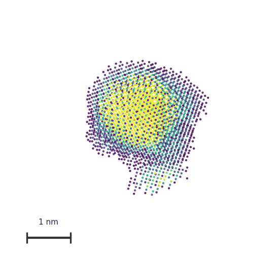

# autoSAXS

**autoSAXS** is a Python toolkit for reproducible small-angle X-ray scattering (SAXS) pipelines — from detector images to subtracted curves, size distributions, and shape models — usable from a **CLI**, from **Python**, or from desktop GUIs.

<p align="center">
  
</p>

## Why autoSAXS

- **One skills API for everything** — the same processing steps run as `autosaxs <skill> …` or as Python functions with stable signatures, so scripts, GUIs, and agents share one surface.
- **Unique algorithms** — **automatic calibration** from calibrant frames and **automatic buffer scaling** for robust sample−buffer subtraction, reducing manual tuning at the beamline.
- **Flexible inputs** — path expressions (file, directory, or glob) instead of “one file only,” with consistent expansion rules.
- **Opt-in caching** — re-run interactive work without recomputing unchanged steps.
- **GUIs when you want them** — `guisaxs-skills` (form-driven skill runner) and `guisaxs-liveview` (watch-folder live processing with optional monodisperse / polydisperse analysis).
- **Built for automation** — designed for reproducible beamline-to-analysis workflows and LLM/agent-driven runs via the CLI.
- **Seamless AI integration** — ship a built-in **`saxs-processing`** Cursor/agent skill (`autosaxs get-skills`) so assistants can orchestrate the pipeline from documented procedures.

## Use cases

- Synchrotron or lab SAXS: calibrate geometry, integrate TIFF stacks, average frames, and subtract buffer.
- Monodisperse analysis: Guinier → pair-distance distribution p(r) → optional ab initio (DAMMIF) / bodies / DENSS density maps.
- Polydisperse analysis: Guinier → size distribution D(R) → optional McSAS or ATSAS MIXTURE.
- Live experiments: watch a folder for new detector images and process them as they arrive.
- Scripting and agents: drive the full pipeline from Python or `autosaxs` without reimplementing I/O conventions.

## Install

Core + CLI:

```bash
python -m pip install "autosaxs @ git+https://github.com/MikhailLifar/autoSAXS.git"
autosaxs --help
```

With desktop GUIs (`guisaxs-skills`, `guisaxs-liveview`):

```bash
python -m pip install "autosaxs[gui] @ git+https://github.com/MikhailLifar/autoSAXS.git"
```

Helper commands (export docs and defaults into a directory):

- `autosaxs get-docs` — write the short `README.md` and detailed `autosaxs-docs/skills_reference.md`
- `autosaxs get-skills` — write Cursor-style `saxs-processing/` skill procedures
- `autosaxs get-default-config` — copy bundled `config_base.conf`

Upgrade from git `main`: `autosaxs -U`

## Main features

Pipeline stages exposed as skills: **calibrate → integrate / average → subtract → analyze → report**, including Guinier, Kratky, `fit_distances` (p(r)), `fit_sizes` (D(R)), `model_dam`, `model_bodies`, `model_density` (DENSS), `model_dr_mc` (McSAS), `model_mixture`, and reporting helpers.

Apps: **guisaxs-skills** (catalog + forms + isolated CLI runs) and **guisaxs-liveview** (queued live integration, buffer subtraction, optional analysis wizards).

Full per-skill documentation: [`autosaxs-docs/skills_reference.md`](autosaxs-docs/skills_reference.md).

## Acknowledgements

autoSAXS builds on the SAXS ecosystem rather than replacing it:

- **[pyFAI](https://pyfai.readthedocs.io/)** — detector geometry, calibration, and 1D integration.
- **[ATSAS](https://www.embl-hamburg.de/biosaxs/download.html)** — tools such as `autorg`, `datgnom`, `gnom`, `dammif`, `mixture`, and `bodies` (external install; recommended **ATSAS 3.2.1**). Importing autoSAXS **warns** if ATSAS is missing; skills that shell out to ATSAS **raise** immediately when it is unavailable.
- **[DENSS](https://www.tdgrant.com/denss)** — electron-density reconstruction (`model_density`).
- **[McSAS](https://github.com/BAMresearch/McSAS) / McSAS3** — Monte Carlo polydisperse sizing (`model_dr_mc`).

## Contacts

- **Mikhail S. Lifar** — `mikhailkulkov11@gmail.com`
- Affiliation: The Smart Materials Research Institute, Southern Federal University (Rostov-on-Don)
- Project: [github.com/MikhailLifar/autoSAXS](https://github.com/MikhailLifar/autoSAXS)

## Contributing

Issues and pull requests are welcome on GitHub. Bug reports, clearer docs, and new skill coverage all help. Licensed under the **Apache License 2.0**.
